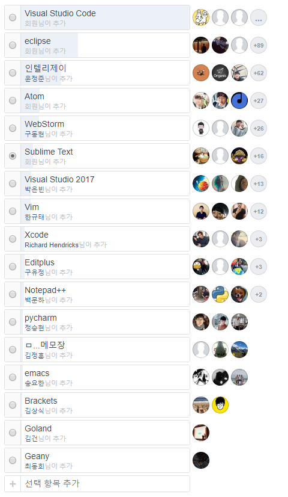

# 개발 툴
1. 개발 툴 별 사용량과 장단점
2. 내가 쓰는 툴의 기능 및 주요 단축키

###### 자료출처
- http://junil-hwang.com/blog/category/tool/sublimetext/
- https://www.beginmate.com/magazine/49
- 위키백과
- 나무위키
- facebook 생활코딩 

---

## 개발 툴 이란?

```
소프트웨어 개발자가 다른 프로그램과 응용 프로그램을 만들고
오류를 고치고 유지 보수하는 데에 사용하는 프로그램이나 응용 프로그램이다.
이 용어는 보통 어떠한 작업을 완성할 목적으로 함께 묶을 수 있는 상대적으로 단순한 프로그램을 가리킨다.
여러 개의 도구로 물리적 객체를 수정할 수 있다. 
```

## 개발 툴의 종류
- *Sublime Text*
- *Atom*
- *Brackets*
- *Web Storm*
- *eclipse*
- *Edit+*
- Visual Studio Code (vscode)
- IntelliJ
등등
>강조 되어 있는 툴 들은 아주 조금이라도 제가 직접 사용해본적이 있는 툴 입니다.

---

## 2018 StackOverflow 글로벌 개발자 설문조사 (사용 툴)


그래프에서 3위까지의 순위는 아래와 같습니다.
1. Visual Studio Code
2. Visual Studio
3. NotePad++

3위 까지의 각 툴들을 짧게 소개 하자면
### 1. Visual Studio Code
>https://code.visualstudio.com/

비주얼 스튜디오 코드(영어: Visual Studio Code)는
마이크로소프트가 마이크로소프트 윈도우, macOS, 리눅스용으로 개발한 소스 코드 편집기이다.
디버깅 지원과 Git 제어, 구문 강조 기능등이 포함되어 있으며,
사용자가 편집기의 테마와 단축키, 설정 등을 수정할 수 있다.

비주얼 스튜디오 코드는 깃허브가 개발한 일렉트론 프레임워크를 기반으로 구동된다.
그러나 같은 일렉트론 기반의 편집기 아톰을 포크한 것은 아니며,
비주얼 스튜디오 온라인 에디터(코드명 "모나코")를 기반으로 개발되었다.

터미널을 자체 내장하고 있어서 별도로 터미널 창을 열 필요가 없다. 게다가 코드 치는 연습만 한다고 하면 가벼운 이쪽이 더 유리하다. 비주얼 스튜디오를 미리 설치해 놓은 경우 인텔리센스가 자동으로 지원된다. 그 기원답게 Git 연동을 직접 지원하며 TFS 연동은 확장을 설치하면 가능하다. 작업 디렉토리에 git init만 되어 있으면 별도의 설정 없이 자동으로 연동되어 commit 관리나 알록달록한 diff 등을 편리하게 이용 가능하다.

### 2. Visual Studio
>https://visualstudio.microsoft.com/ko/vs/whatsnew/

마이크로소프트 비주얼 스튜디오(Microsoft Visual Studio)는 마이크로소프트 윈도우에서 작동하며, 다양한 언어로 프로그래밍할 수 있는 마이크로소프트의 통합 개발 환경이다. 프로그램, 웹 사이트, 웹 프로그램 등을 개발할 수 있다. 마이크로소프트에서는 비주얼 베이직, 비주얼 C#, 비주얼 J# 등 특정한 언어로만 프로그래밍할 수 있는 언어별 버전도 제공하고 있다.

마이크로소프트에서 개발한 통합 개발 환경. 이거 하나만 있으면 윈도우에서 돌아가는 프로그램은 일반 애플리케이션이든 웹 애플리케이션이든 거의 다 만들 수 있다. 그러나 그만큼 용량이 80GB 정도로 크고 아름다우며 또 설치 과정도 상당히 길다. 다만 그 많은 것들을 반드시 다 설치해야 하는 경우는 없고, 관련 지식이 없다면 최초에 정해 주는 대로만 깔면 충분히 쓸 수 있다. 
```
VScode 와 VS 의 차이
- VS 코드는 편집기이지만 VS는 IDE입니다.
  (문서 편집기 또는 텍스트 에디터(text editor)는 단순한 문서 파일을 편집하기 위해 쓰이는 소프트웨어이다.)
  (IDE는 코딩, 디버그, 컴파일, 배포 등 프로그램 개발에 관련된 모든 작업을 하나의 프로그램 안에서 처리하는 환경을 제공하는 소프트웨어이다.)
- VS 코드는 플랫폼과 속도가 빠르지만
  VS는 Windows / Mac에서만 사용할 수 있으며 빠르지는 않습니다.
```
### 3. NotePad++
>https://notepad-plus-plus.org/

노트패드++(Notepad++)는 문서 편집기이자 소스 코드 편집기이다. 윈도에서 기본으로 제공하는 문서 편집기인 메모장에 견주어 노트패드++는 탭 편집을 제공하므로 여러 개의 파일을 동시에 열어서 편집할 수 있다.

이 프로그램은 오픈 소스인 GPL 자유 소프트웨어로 배포된다. 이 프로젝트는 소스포지.넷에서 호스팅하여 이천칠백 만 건이 넘는 다운로드 수를 기록하였다.[2][3] 그리고 소스포지.넷 커뮤니티가 선정한 최고 개발 도구상을 두 번 타기도 하였다.[4] 2010년 6월부터는 노트패드++ 프로젝트를 TuxFamily에서 호스팅하고 있다. 노트패드++은 Scintilla 편집기 구성 요소를 사용하여 문서와 프로그래밍 언어 소스 코드 파일을 나타내고 편집한다.

## facebook 생활코딩 그룹 멤버 사용 툴 조사 (181202 ~ 181207)
>https://www.facebook.com/groups/codingeverybody/permalink/2537858026254718/



페이스북 조사에서도 VScode가 가장 많이 사용하는 개발 툴로 결과가 나왔다.

---

## 개발 툴의 장단점 비교

### VScode의 장단점
* 장점
  + 기본으로 포함된 인코딩 관련 기능이 가장 편함
  + 최근 닫은 파일 목록 기능이 기본 포함되어있음
  + CSS에 대해서 훨씬 상세한 유효성 체크 기능을 제공(일반적으로 사용되지 않는 변수 찾기, 괄호 빼먹은거 찾아주기)
  + 기본적으로 지원되는 통합 터미널
  + 사이드바 기능

* 단점
  + (굳이 뽑자면)꽤 많이 쓰이는 미니맵 기능이 아직 없다고 한다.
  >그마저도 사이드바 기능이 커버
  
사용량 1위의 툴이라서 그런지 단점이 정말 거의 없는 것 같다.
가장 많이 뽑힌 장점은 가볍고, 강력한 확장성이었던 거 같다.

### Atom의 장단점
* 장점
  + github에서 만든 이기 때문에 git 기능이 기본적으로 포함되어 있으며 훌륭함.
  + (개인적)테마, UI등 이쁘다.
  
* 단점
  + 실행 속도가 가장 느리며 버벅거릴 때가 있다.
  
github에서 만든 툴이라서 그런지 git에 대한 기능이 가장 좋다는 평이 많았다. 무겁고 느린게 아쉬운 툴이다.

### Sublime Text의 장단점
* 장점
  + 가볍고 매우 빠르다.
  + 커맨드 파레트 등을 이용하면 아예 마우스 없이도 쓸 수 있다.
  + 자동완성 기능이 강력하다.
  + 다중선택 기능이 강력하다.
* 단점
  + 무료로도 사용할 수 있지만 파일 저장을 하다보면 유료로 쓰라는 팝업이 떠서 귀찮다.
  + 한글 입력이 잘 안 된다.
  
가볍고 가장 빨라서 좋고 개인적으로 UI나 테마가 심플해서 좋다.

### WebStorm의 장단점
* 장점
  + 자바스크립트 프로그래밍에서 절대적인 최고의 에디터로 개발자 사이에서 유명하다고 한다.
  + 자바스크립트 라이브러리 함수까지 자동완성
  + 사전을 통한 오타 검색으로 오류를 막을 수 있게 해준다.
* 단점
  + 유료다.
  
---

## Sublime Text 단축키 소개
http://junil-hwang.com/blog/sublimtext-%EB%8B%A8%EC%B6%95%ED%82%A4/
